# AI/ML-Powered Intelligent Dead Reckoning System

> Seamless smartphone navigation when GNSS disappears: tunnels, underpasses, parking levels, urban canyons.

| | | |
|---|---|---|
|  |  |  |
|  |  |  |
|  |  |  |

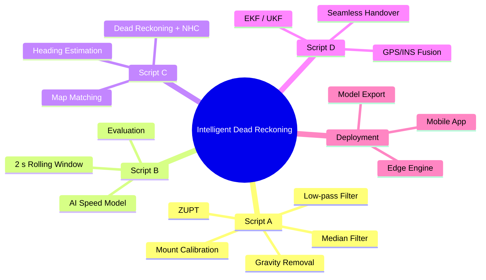

---

## Table of Contents

- [Problem Statement](#problem-statement)
- [Overview](#overview)
- [Architecture](#architecture)
- [Data Flow](#data-flow)
- [Tech Stack](#tech-stack)
- [Team](#team)
- [Phases](#phases)
- [Performance Benchmarks](#performance-benchmarks)
- [Dataset](#dataset)
- [Current Status](#current-status)
- [Deployment](#deployment)
- [Milestone Tracker](#milestone-tracker)

---

## Problem Statement

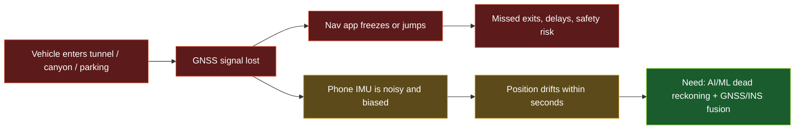

| Challenge | Why it hurts |
|---|---|
| Consumer MEMS IMU | Bias, thermal noise, error grows exponentially |
| Road vibration | Potholes, engine harmonics, braking |
| No OBD-II speed feed | Speed must come from the phone alone |
| Loose phone mount | Orientation relative to the vehicle is unknown |

---

## Overview

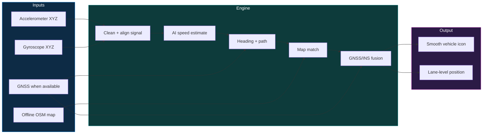

---

## Architecture

The 10-step pipeline, grouped into the 4 scripts that teammates build independently.

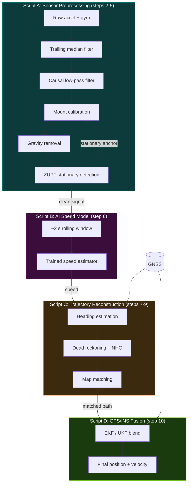

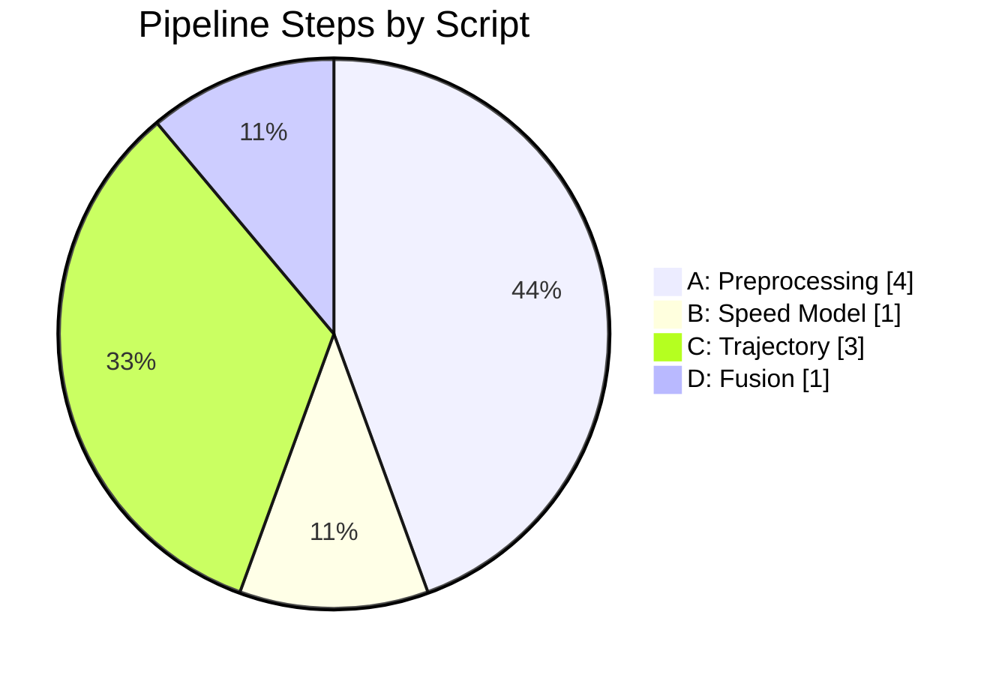

---

## Data Flow

Mode switching between GNSS-aided INS and pure dead reckoning.

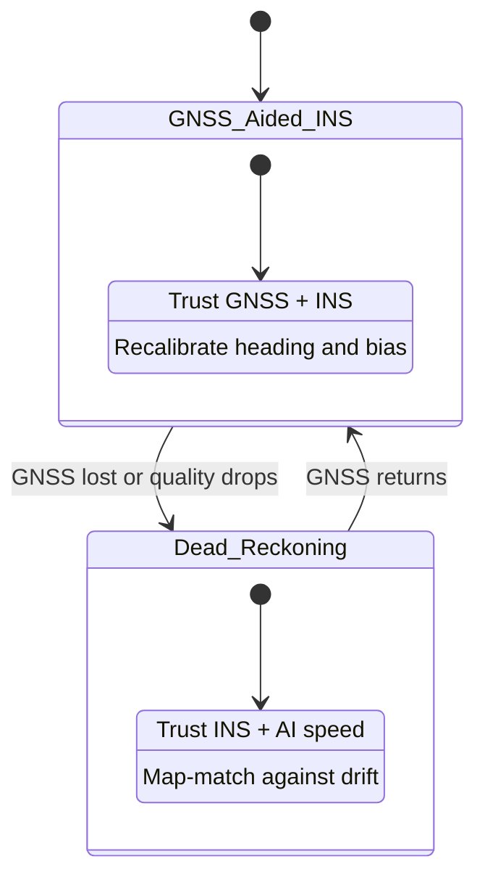

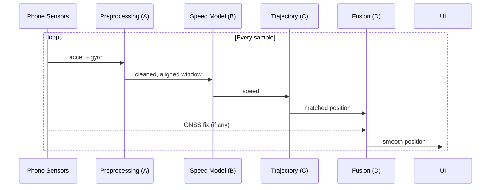

| Interface | Passed between |
|---|---|
| Clean signal | A → B |
| Speed | B → C |
| Map-matched trajectory | C → D |
| Fused position + velocity | D → UI |

---

## Tech Stack

> Proposed stack, adjust to what the team finalises.

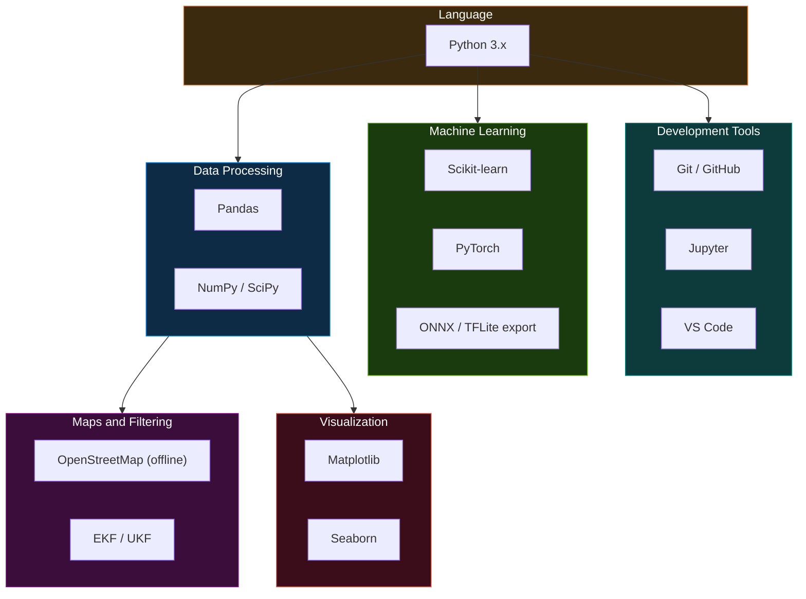

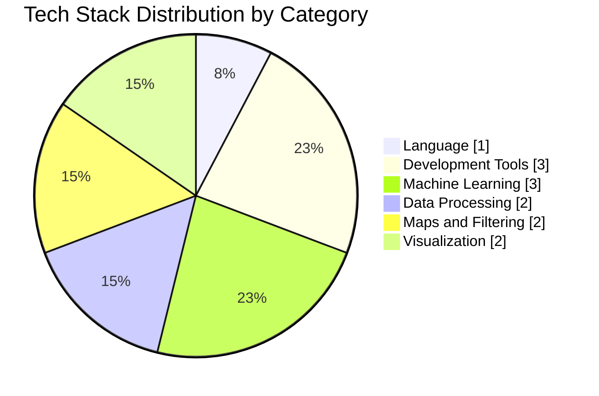

| Category | Technologies | Purpose |
|---|---|---|
| Language | Python 3.x | Primary language |
| Data Processing | Pandas, NumPy, SciPy | Signal handling and numerics |
| Machine Learning | Scikit-learn, PyTorch | Speed model training and inference |
| Export | ONNX / TFLite | Lightweight on-device model |
| Maps and Filtering | OpenStreetMap, EKF / UKF | Map matching and fusion |
| Visualization | Matplotlib, Seaborn | Trajectory and error plots |
| Version Control | Git / GitHub | Collaboration |

---

## Team
The project is executed by a team of **6 members** led by **Anya Jain**.

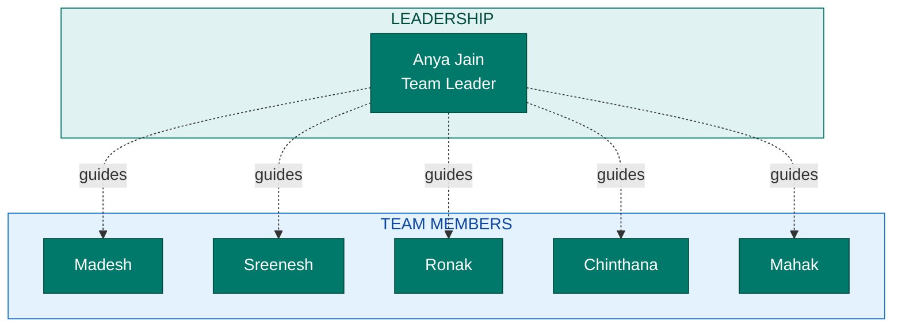

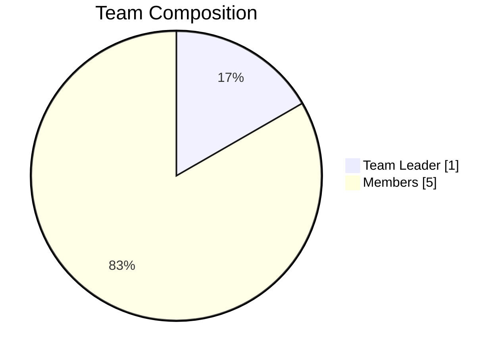

| # | Name | Position |
|---|---|---|
| 1 | Anya Jain | Team Leader |
| 2 | Madesh | Member |
| 3 | Sreenesh | Member |
| 4 | Ronak | Member |
| 5 | Chinthana | Member |
| 6 | Mahak | Member |

## Phases

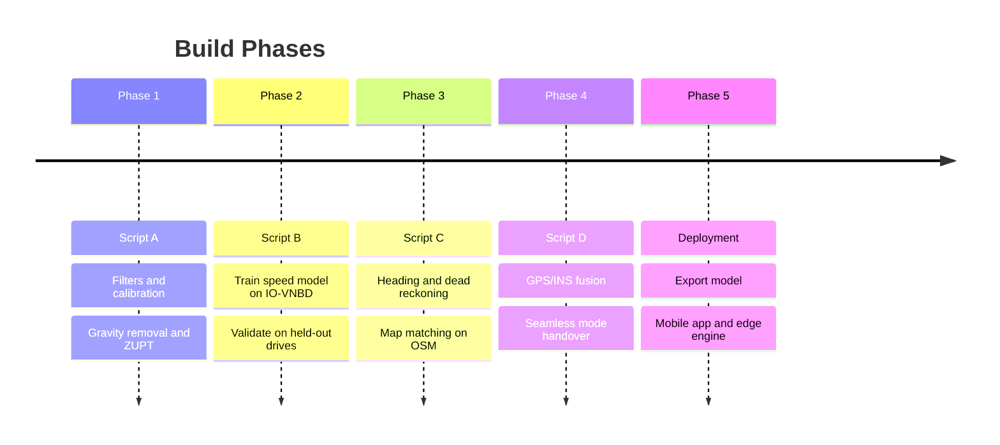

---

## Performance Benchmarks

| Mode | Target |
|---|---|
| Dead reckoning (drift) | < 10% of distance travelled |
| Short outage | < 5 m drift over 50 m, under 1 min |
| Long outage | < 100 m drift over 1 km at 60 km/h |
| GNSS+INS fusion (phone) | 10 Hz position updates |
| GNSS+INS fusion (edge, FOG IMU) | ~200 Hz |
| Mode switch | Within milliseconds of GNSS loss or return |

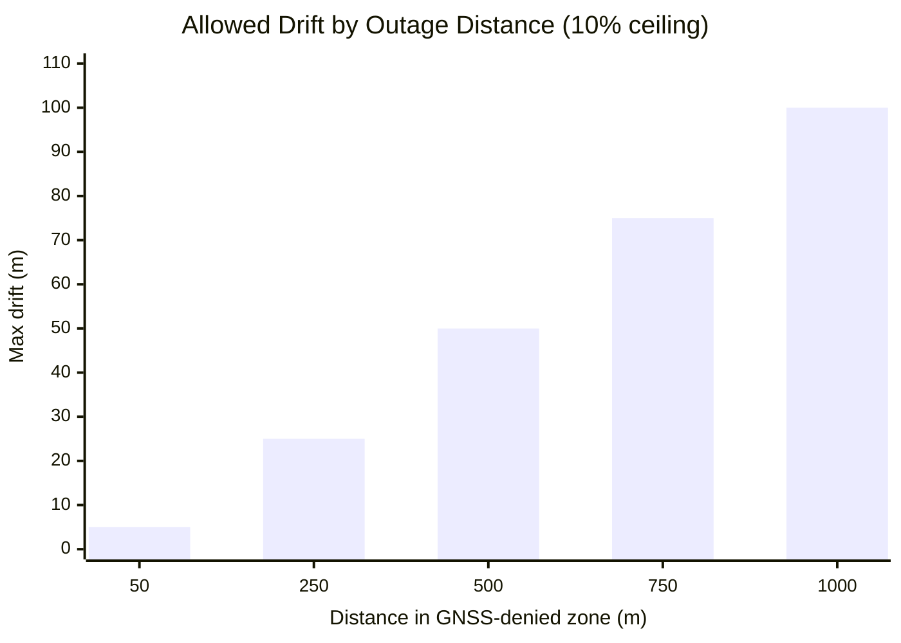

---

## Dataset

**IO-VNBD**: Inertial and Odometry benchmark for ground vehicle positioning.

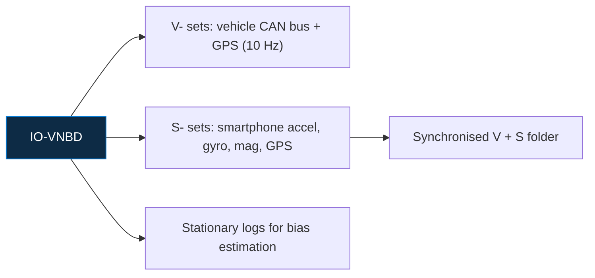

| Fact | Value |
|---|---|
| Total data | ~5,700 km over ~98 h |
| Countries | UK, France, Nigeria |
| Sensors | Accelerometer, gyroscope, magnetometer, GPS |
| Scenarios | 32 (hard brake, roundabouts, potholes, rain, motorway, etc.) |
| Stationary data | 20+ min for sensor bias estimation |

---
## Current Status

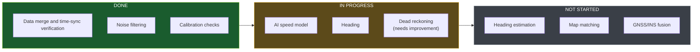

- **Done:** data merge and time-sync verification, noise filtering, calibration checks
- **In progress:** AI speed model, heading, dead reckoning (needs improvement)
- **Not started:** heading estimation, map matching, GNSS/INS fusion

---

## Results so far
1. Noise filtering 
3. ZUPT  
4. Automatic mount recalibration 
5. Gravity removal 

## Files

- `Data_preprocessing_verified.py`: merges phone + vehicle data and checks time sync
- `Script_A.py`: noise filtering, calibration, ZUPT
- `Script_B_Part_1`: AI speed model (partial)

| Path | Content |
|---|---|
| `merged_raw.csv` | Merged and timestamp-aligned dataset |
| `script_a_clean_continuous.csv` | Cleaned vehicle-frame dataset |
| `results/per_trip_summary.csv` | Per-trip calibration and validation metrics |
| `results/sensor_noise_estimate.json` | Measured sensor noise variance per axis |
| `figures/*.png` | Validation figures shown above |
| `trip_split_report.csv` | Report of splitting dataset |
| `windowed_data.npz` | Windowed and split dataset |
## Deployment

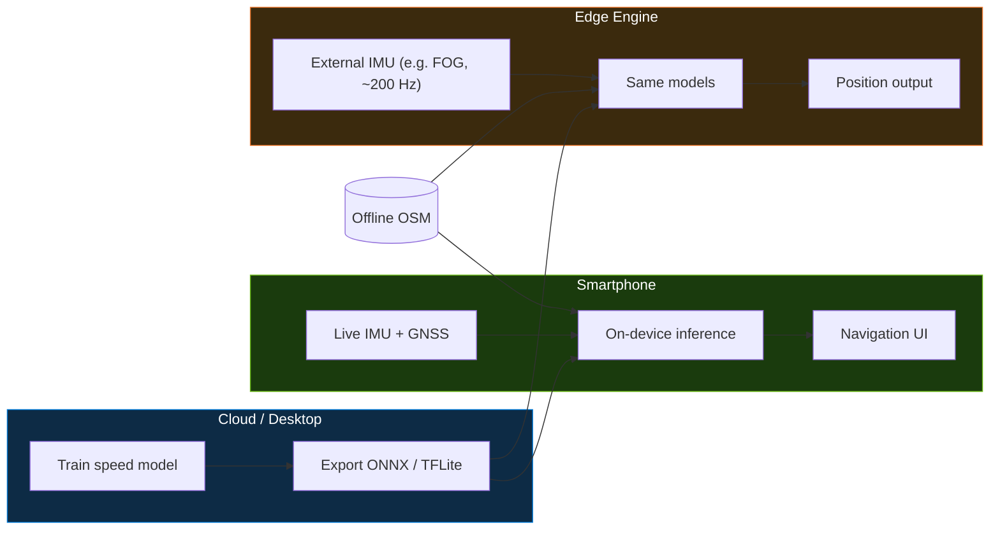

---

## Milestone Tracker

- [ ] Script A: preprocessing pipeline
- [ ] Script B: speed model trained, position plot on IO-VNBD subset
- [ ] Script C: heading, dead reckoning, map matching
- [ ] Script D: GPS/INS fusion
- [ ] Model export to phone
- [ ] Mobile app with smooth navigation UI
- [ ] Edge engine tested with external IMU data
- [ ] Benchmark run against drift targets
