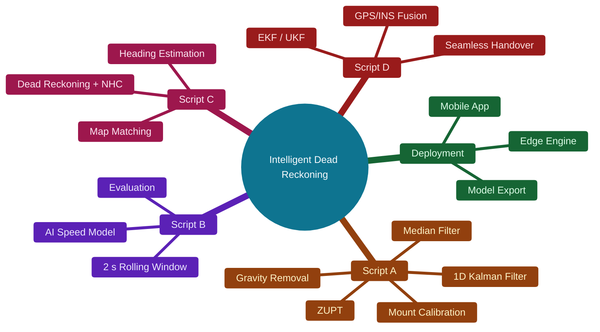
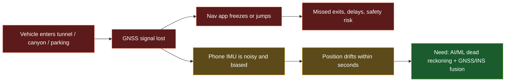
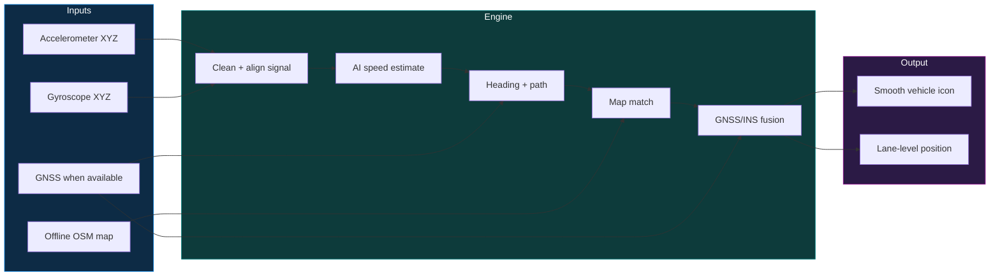
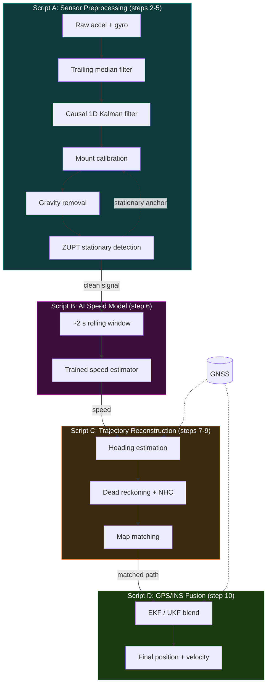
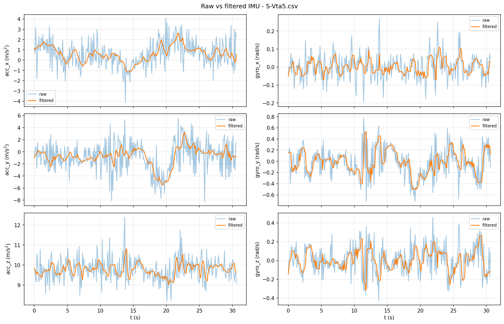
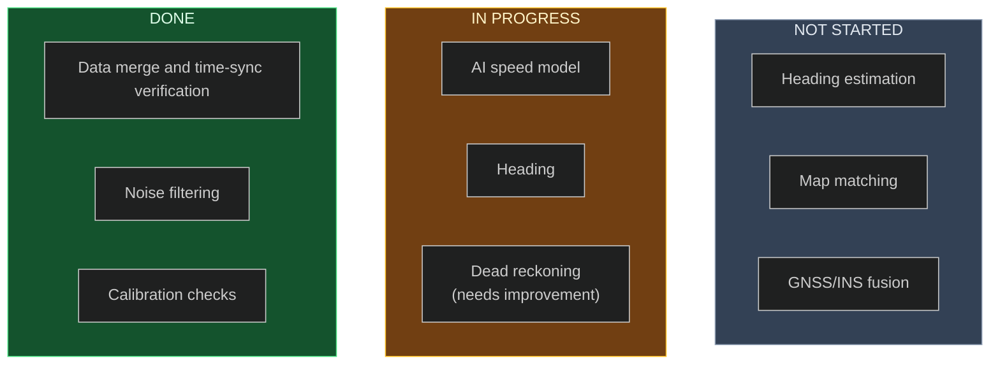
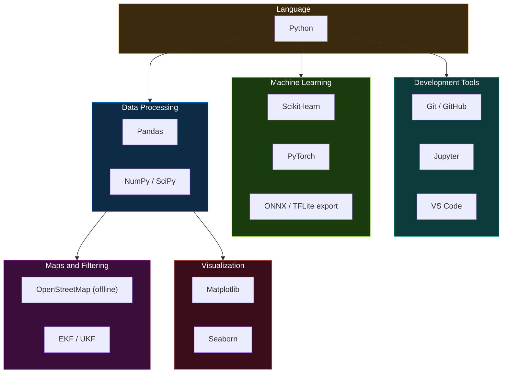
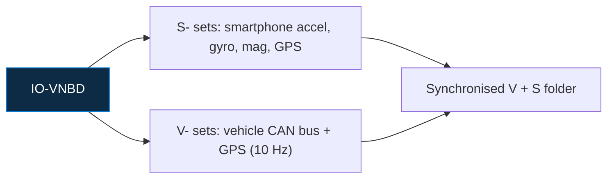
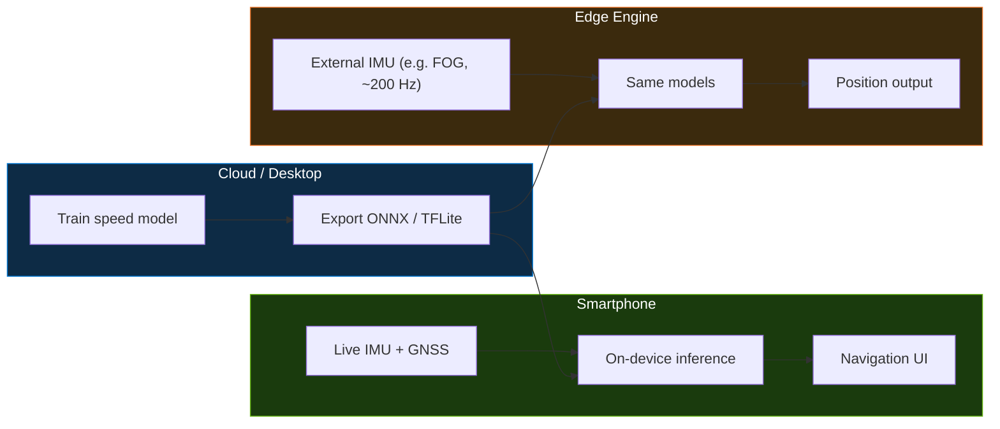

# AI/ML-Powered Intelligent Dead Reckoning System

> Seamless smartphone navigation when GNSS disappears: tunnels, underpasses, parking levels, urban canyons.

## Table of Contents

| | | |
|---|---|---|
|  |  |  
|  |  |  
|  |  |  |

---

---
## Problem Statement

| Challenge | Why it hurts |
|---|---|
| Consumer MEMS IMU | Bias, thermal noise, error grows exponentially |
| Road vibration | Potholes, engine harmonics, braking |
| No OBD-II speed feed | Speed must come from the phone alone |
| Loose phone mount | Orientation relative to the vehicle is unknown |

---

## Overview

---

## Architecture

The 10-step pipeline, grouped into the 4 scripts.

---
## Results so far
1. Noise filtering 
3. ZUPT  
4. Automatic mount recalibration 
5. Gravity removal 

---

## Current Status

- **Done:** data merge and time-sync verification, noise filtering, calibration checks
- **In progress:** AI speed model, heading, dead reckoning (needs improvement)
- **Not started:** heading estimation, map matching, GNSS/INS fusion

---

## Tech Stack

> Proposed stack, adjust to what the team finalises.

---
## Dataset

**IO-VNBD**: Inertial and Odometry benchmark for ground vehicle positioning.

| Fact | Value |
|---|---|
| Total data | ~5,700 km over ~98 h |
| Countries | UK, France, Nigeria |
| Sensors | Accelerometer, gyroscope, magnetometer, GPS |
| Scenarios | 32 (hard brake, roundabouts, potholes, rain, motorway, etc.) |
| Stationary data | 20+ min for sensor bias estimation |

---
## Deployment

---
## Files

- `Data_preprocessing_verified.py`: merges phone + vehicle data and checks time sync
- `Script_A.py`: noise filtering, calibration, ZUPT
- `Script_B_Part_1`: AI speed model (partial)

| Path | Content |
|---|---|
| `merged_raw.csv` | Merged and timestamp-aligned dataset |
| `script_a_clean_continuous.csv` | Cleaned vehicle-frame dataset |
| `results/per_trip_summary.csv` | Per-trip calibration and validation metrics |
| `results/sensor_noise_estimate.json` | Measured sensor noise variance per axis |
| `figures/*.png` | Validation figures shown above |
| `trip_split_report.csv` | Report of splitting dataset |
| `windowed_data.npz` | Windowed and split dataset |
